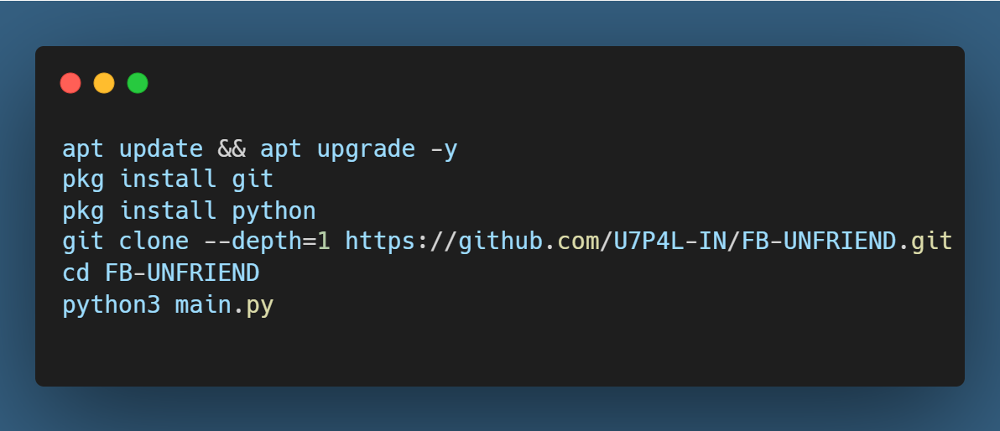
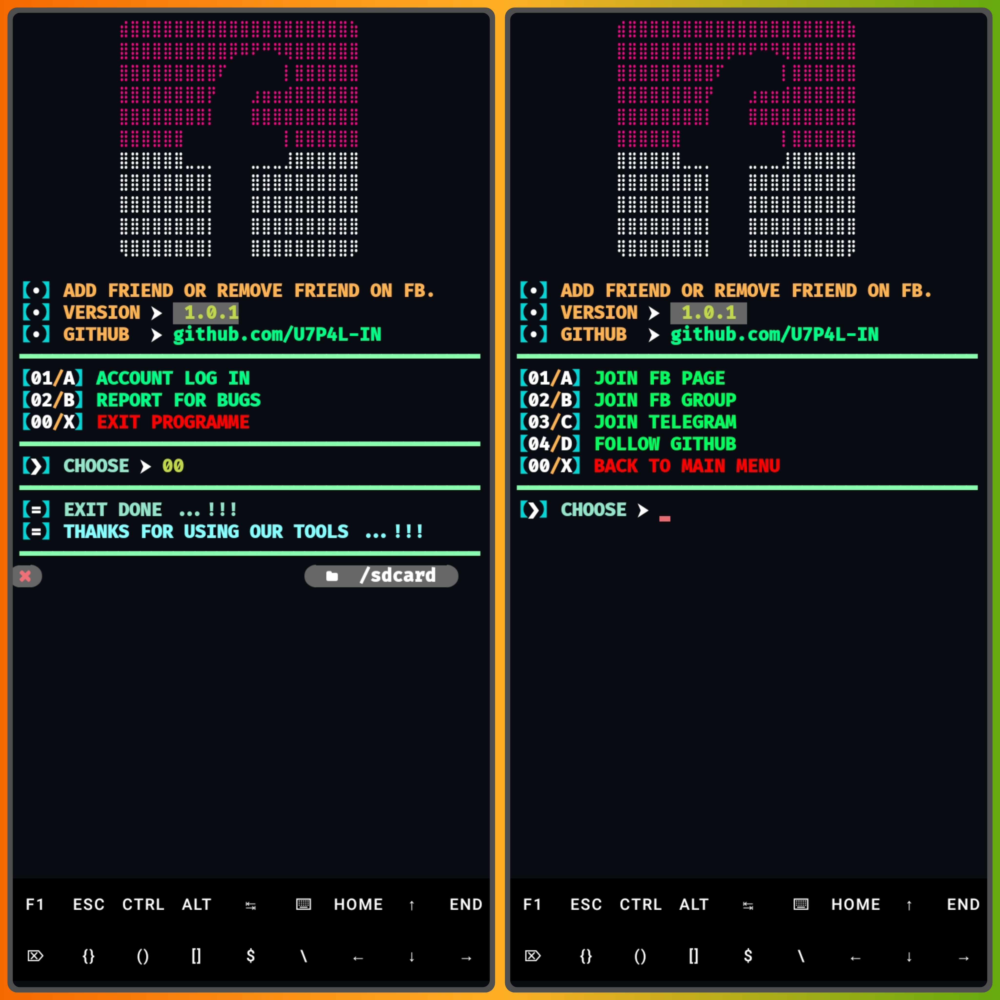
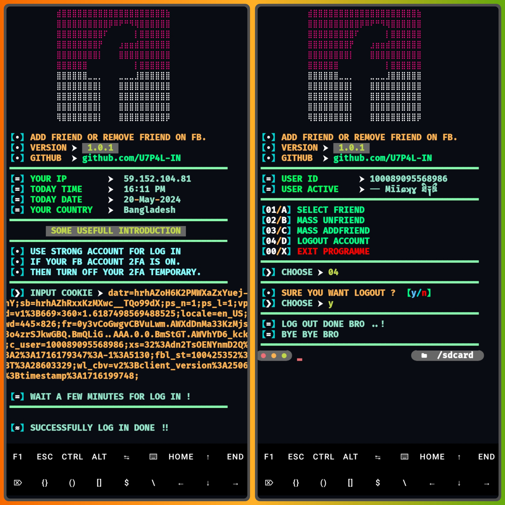
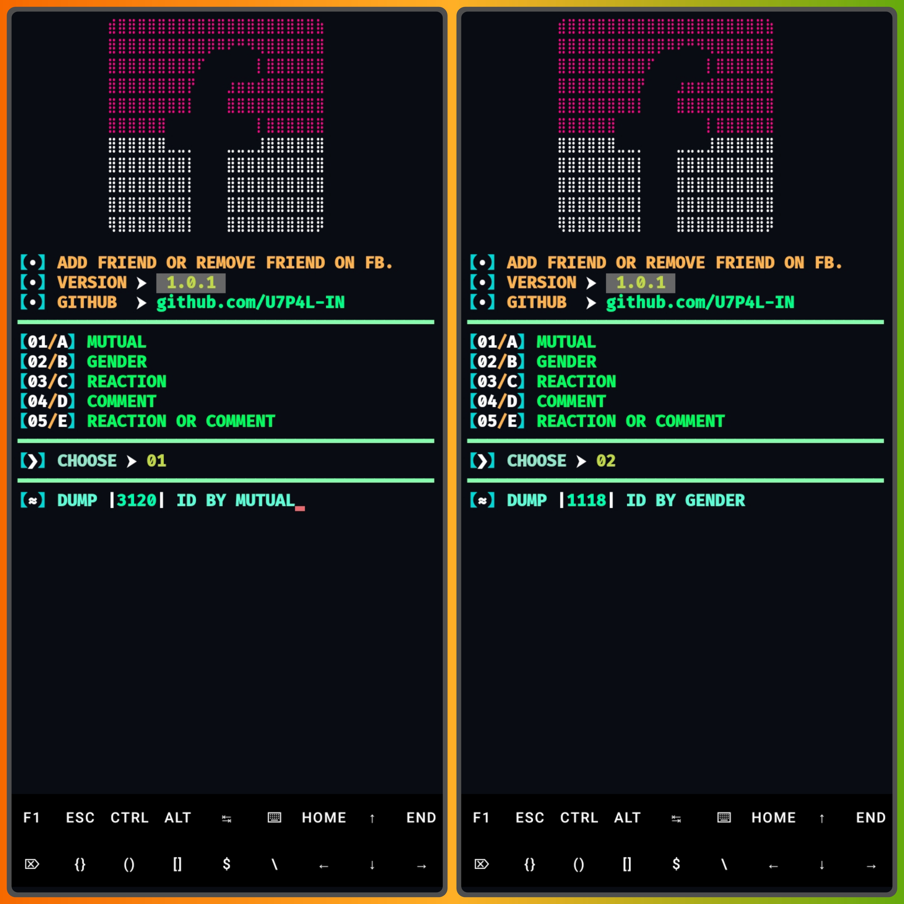
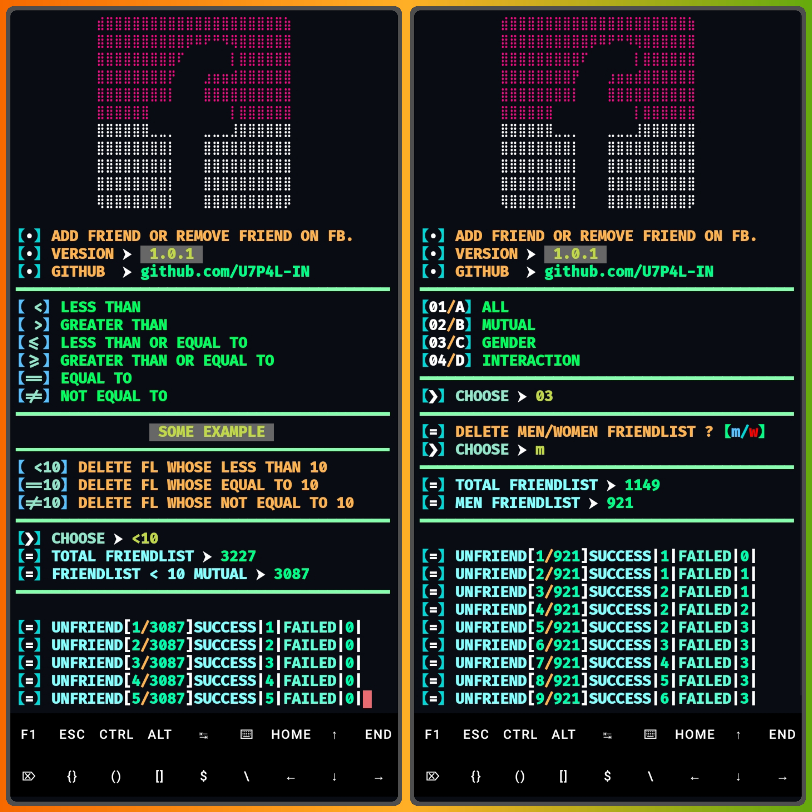
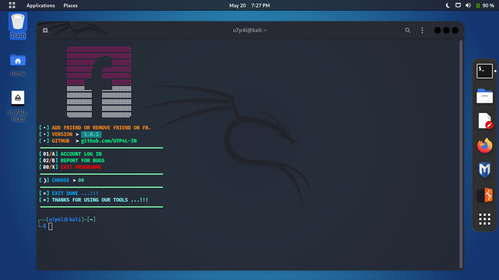
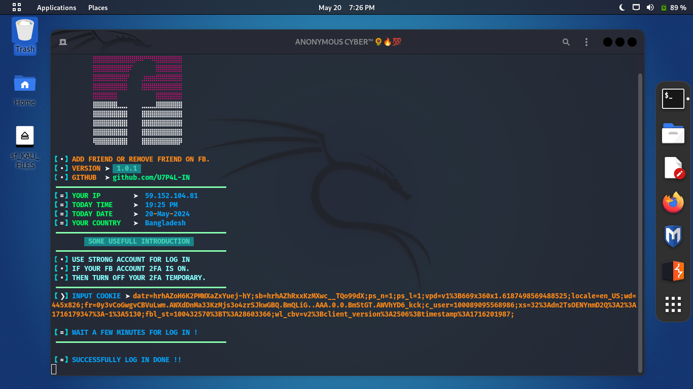
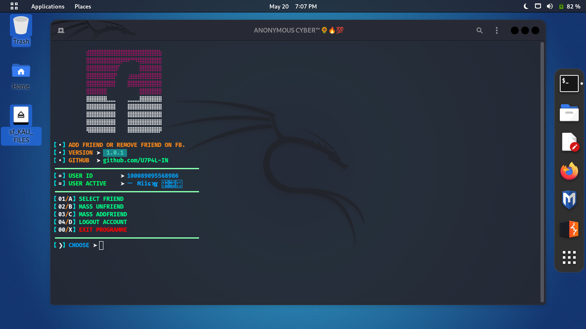
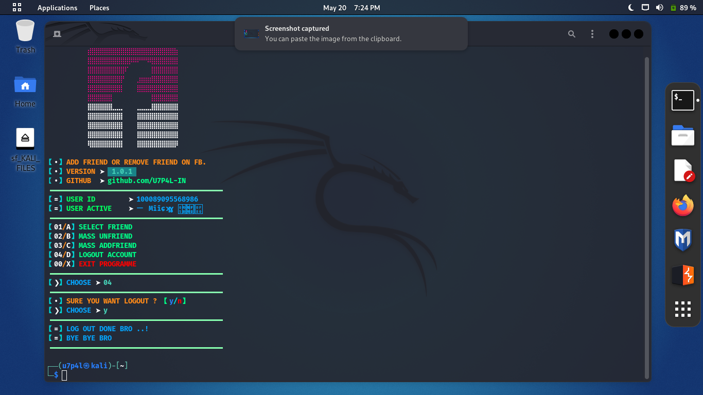

<p align="center">
</p>

</p>
   <p align="center">
      <a href="https://github.com/U7P4L-IN/FB-UNFRIEND/stargazers">
      </a>
      <a href="https://github.com/U7P4L-IN/FB-UNFRIEND/releases/latest">
      </a>
      <a href="https://www.conventionalcommits.org/en/v1.0.0/">
      </a>
      <a href="https://github.com/U7P4L-IN/FB-UNFRIEND/actions/workflows/github-action.yml">
      </a>
   </p>
   
</br>

> This is a simple Python script for automatically unfriending facebook all typs of users 

## Features
- [x] Unfriend All Friends
- [x] UnFriend By Mutual
- [x] Unfriend By Gender
- [x] Unfriend By Interaction
## Requirements - 
- Stable Internet Connection
- Termux Version Upto Date
- Android 7 or higher
- Need Fb Fresh Cookie
- No Termux Knowlegde

<h4 align="left">TESTED ON > </h4>

* Kali Linux
* Termux
* Mac os
* Ubuntu
* Perrot Sec OS

## Prerequisites
1. Python 3.x installed on your system.

## Usage

1. Clone or download this repository to your local machine.
2. Open the terminal and navigate to the downloaded directory.
3. Install the required dependencies using the following command
4. Then Input Your Fb Cookies ON this Command
5. Select {1} For DUMP Your Friends  Which Type Of Want.
6. Go Back and Run Again 
7. Select {2} For Unfriending Which Type Of Friends You Dump Past

<h4 align="left">INSTALL TOOL ON TERMUX > </h4>

```shell
 pip install requests
```

```bash
apt update && apt upgrade -y
pkg install git
pkg install python
git clone --depth=1 https://github.com/U7P4L-IN/FB-UNFRIEND.git
cd FB-UNFRIEND
python3 main.py
```
- **Running on Termux**  
 ```bash
cd FB-UNFRIEND
git pull
python main.py
 ```
<p align="center">

<h2 align="left"><b>TERMUX ></b></h2>

### Menu >
<p align="center">

### Cookie log in and Feature >
<p align="center";>

### Fb Account Friends Selection >
<p align="center";>
<p align="center";> 

### Now Unfriending Your Selected Accounts >
<p align="center";> 

# Report bugs
If you notice issues while installing this tool or running this tool kindly mail to me at <a href="mailto: lisame0007@gmail.com">Gmail</a> or Open an issue via github.

### Requirements 
```
python-3
pip
Internet Connection
And some other python packages
``` 
[Python 3](https://www.python.org/downloads/)

<hr>

<h3 align="left">Install Requirements (on Linux) > </h3>

```bash
>> apt-get install git python3 python3-pip python python-pip
```
<h3 align="left">Kali Linux/Ubuntu/Parrot os > </h3>

```bash
sudo apt-get update && apt-get install git
git clone https://github.com/U7P4L-IN/FB-UNFRIEND.git
cd FB-UNFRIEND
ls
sudo python3 main.py
```
<h2 align="left"><b>KALI LINUX > </b></h2>

<p align="center">
<p align="center">
<p align="center">
<p align="center">
</br>

<p align="center">  <a href="https://t.me/TheU7p4lArmyX"></a></p>

</br>

### Tools Languages :

<p align="center">

</p>

<br>

### No FB-UNFRIEND appearing?

- Doesn't work for cookies or new accounts!
- Maybe your Facebook account is checkpointed or locked.
- The Facebook system has been repaired causing failure to get Unfriending.

### Why login failed?

- Your Facebook account cookies are no longer valid or expired.
- Your Facebook account is logged out of the browser.
- Maybe your Facebook account has been checkpointed or temporarily locked.


### Contributing
Feel Free To Clone This Project. For Major Changes, Please Open An Issue First To Discuss What You Would Like To Change Or Add, Thank You!!.

<h2 align="center">LICENSE</h2>

**FB-UNFRIEND** is released under the GNU General Public License v3.0, which grants the following permissions:
- Commercial use
- Distribution
- Patent use
- Private use

For more convoluted language, see the [LICENSE](/LICENSE).
</br>

<h5 align="center"><b>DESCRIPTION</b></h5>

* ©️ Copyright Message
>> Copyright © [2023-27] [U7P4L-IN]
>All rights reserved. This Python project, along with its code, documentation, and any associated files, is the intellectual property of ANONYMOUS CYBER. You may not reproduce, distribute, or modify the contents of this repository without explicit permission from the owner.
## Give A Star ⭐
> You can also give this repository a star to show more people and they can use this repository.
